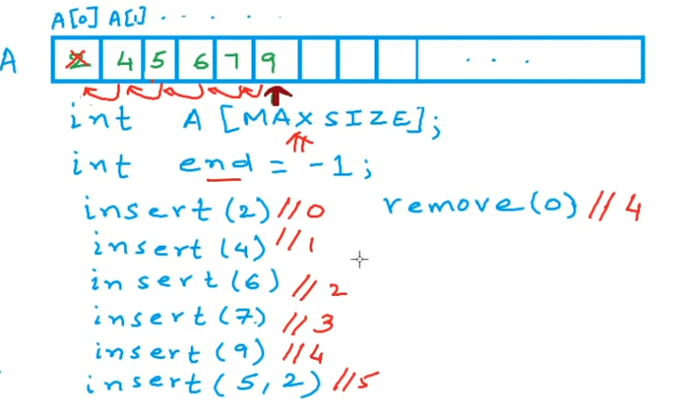
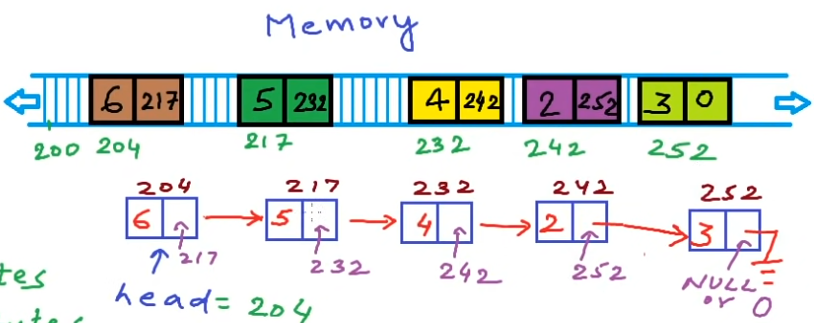
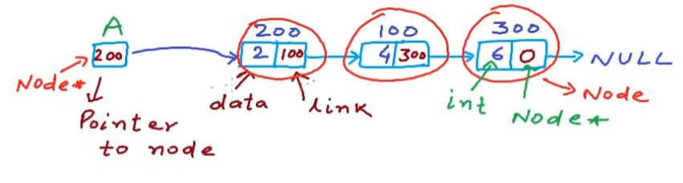
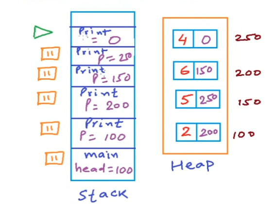
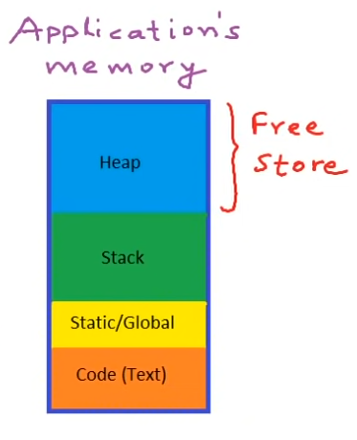
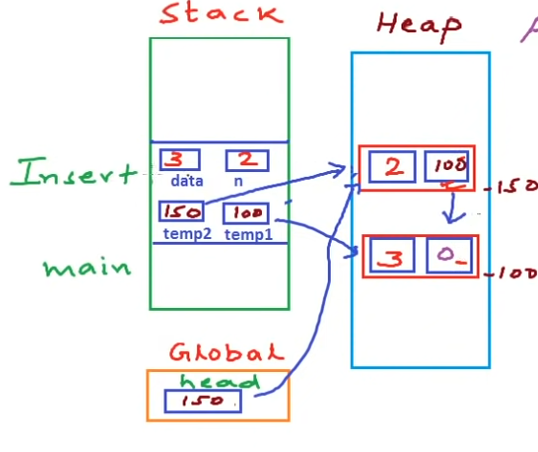
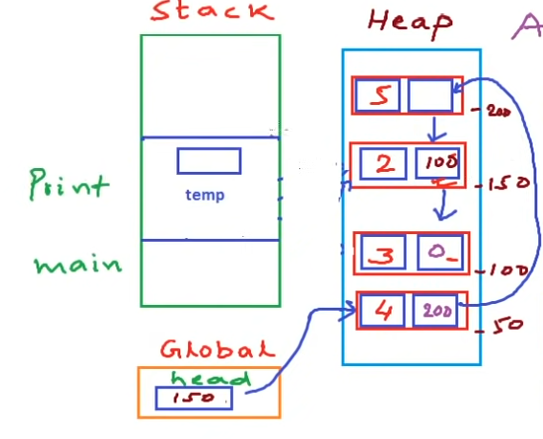
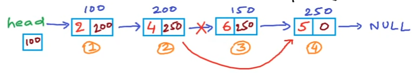
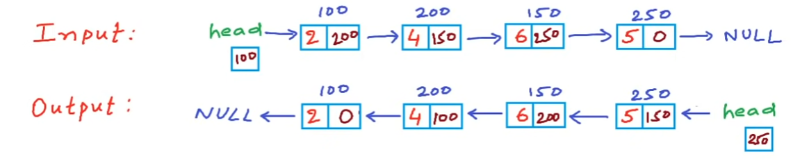

# List 

## List as abstract data type

**List** static
+ store a given number of elements of a given data-type
+ write/modify element at a position
+ read element at a position

**List** dynamic
+ empty list has size 0
+ insert
+ remove
+ count
+ read/modify element at a position
+ specity data-type

## Dynamic List using Array
  
What can we do if the array is full?
+ creat a new larger array of double size
+ copy previous array into the new array
+ free the memory for the previous array

Cost in terms of times:
1. Access - Read/write element at an index - constant time $O(1)$
2. Insert - $T\propto n$ or $O(n)$ cost by shifting
3. Remove - $T\propto n$ or $O(n)$ cost by shifting
4. Add(insert at the end) - $O(1)$ if not full, $O(n)$ if full

## Linked list

```c++
struct Node {
  int data;
  Node* next;
}
```
**head:** address of the first node.

Cost in terms of times:
+ Access - $T\propto n$ or $O(n)$
+ Insert - $O(n)$ just cost by the traversing to the particular position
+ Delete - $O(n)$ just cost by the traversing to the particular position

## Array vs Linked list
|                   |                                       Array                                       |                                 Linked list                                 |
| :---------------: | :-------------------------------------------------------------------------------: | :-------------------------------------------------------------------------: |
| cost of accessing |                                      $O(1)$                                       |                                   $O(n)$                                    |
|   memory usage    |             -fixed size,<br>-may not be available as one large block              | -No unused memory, extra for pointer<br>-available as multiple small blocks |
| cost of inserting | -beginning, $O(n)$<br>-end, $O(1)$(not full) or $O(n)$(full)<br>-$i^{th}$, $O(n)$ |           -beginning, $O(1)$<br>-end, $O(n)$<br>-$i^{th}$, $O(n)$           |
|    easy of use    |                                :heavy_check_mark:                                 |                                     :x:                                     |

## Linked list - Implementation in C/C++


### struct
```c++
struct Node {
  int data;
  Node* link;
};
```
### print (use head pointer as parameter)
```c++
void print(Node* head) {
  Node* temp = head;
  cout << "List is: ";
  while (temp != NULL) {
    cout << temp->data << " ";
    temp = temp->link;
  }
  cout << endl;
}
```
### print using recursion

```c++
// print using recursion
void printRecursion(Node* p) {
  if (p == NULL) {
    cout << endl;
    return;
  }
  cout << p->data << " ";
  printRecursion(p->link);
}
```
***Note: For normal print of the linked list, the iterative method is more efficient than the recursion method. Because in recursion, we will use space in the stack section of the memory for so many function calls.***
```c++
// print in reverse order using recursion
void printReverse(Node* p) {
  if (p == NULL) return;
  printReverse(p->link);
  cout << p->data << " ";
}
```

### Inserting a node at beginning
**head pointer as global var**
```c++
Node* head;
void insert(int x) {
  Node* temp = new Node;
  temp->data = x;
  temp->link = head;
  head = temp;
}
// example call
insert(3);
```
**head pointer as function parameter**
```c++
Node* insert(Node* head, int x) {
  Node* temp = new Node;
  temp->data = x;
  temp->link = head;
  head = temp;
  return head;
}
// example call
head = insert(head, x);
```
**head reference as function parameter**
```c++
void insert(Node** head, int x) {
  Node* temp = new Node;
  temp->data = x;
  temp->link = *head;
  *head = temp;
}
// example call
insert(&head, x);
```

### Inserting a node at $n^{th}$ position
  
#### memory allocation: 
**Code(Text):** store all the instructions that used to be executed.  
**Static/Global:** store the global variables that live for the entire lifetime of the program/application.  
**Stack:** store all the information about function call executions, to store all the local variables.  
**Heap:** requst memory from it during run-time (new, melloc operator). 

***Code, static and stack*** *sections are* ***fixed in size*** *that is decided at compile time,* ***heap*** *is* ***not fixed***.

#### implementation
```c++
// n starts from 1
void insert(int x, int n) {
  Node* temp = new Node;
  temp->data = x;
  temp->link = NULL;
  if (n == 1) {  // if insert at beginning
    temp->link = head;
    head = temp;
    return;
  }
  Node* n_prev = head;
  for (int i = 0; i < n - 2; i++) {
    n_prev = n_prev->link;
  }  //get the node before the inserting position
  temp->link = n_prev->link;
  n_prev->link = temp;
}
// example call
insert(2,1);
```
**memory allocation during `insert(3,2)`**  


**memory allocation during `print()`**  


### Delete a node at $n^{th}$ position

1. Fix hte links
2. Free the space
```c++
// insert at end
void push_back(int x) {
  Node* temp = new Node;
  temp->data = x;
  temp->link = NULL;
  if (head == NULL) {
    head = temp;
    return;
  }
  Node* last_node = head;
  while (last_node->link != NULL) {
    last_node = last_node->link;
  }
  last_node->link = temp;
}
// delete at nth
void deleteAtN(int n) {
  Node* n_prev = head;
  if (n == 1) {
    head = n_prev->link;
    delete n_prev;
    return;
  }
  for (int i = 0; i < n - 2; i++) {
    n_prev = n_prev->link;
  } //navigate to the (n-1)th node
  Node* node_n = n_prev->link;
  n_prev->link = node_n->link;
  delete node_n;
}
// example call
deleteAtN(3);
```

### Reverse a linked list

#### Iterative method
```c++
// reverse iteratively
void reverse() {
  Node *prev, *current, *next;
  prev = next = NULL;
  current = head;
  while (current != NULL) {
    next = current->link;
    current->link = prev;
    prev = current;
    current = next;
  }
  head = prev;
}
// example call
reverse();
```

#### Recursion method
```c++
// reverse recursively
void reverseRecursion(Node* p) {
  if (p->link == NULL) {
    head = p;
    return;
  }
  reverseRecursion(p->link);
  Node* next = p->link;
  next->link = p;
  p->link = NULL;
}
//example call
reverseRecursion(p);
```
