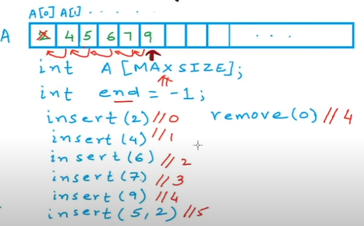
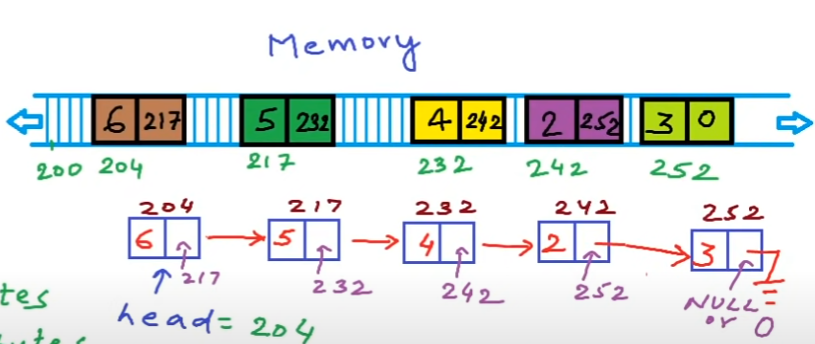

# List 

## List as abstract data type

**List** static
+ store a given number of elements of a given data-type
+ write/modify element at a position
+ read element at a position

**List** dynamic
+ empty list has size 0
+ insert
+ remove
+ count
+ read/modify element at a position
+ specity data-type

## Dynamic List using Array
  
What can we do if the array is full?
+ creat a new larger array of double size
+ copy previous array into the new array
+ free the memory for the previous array

Cost in terms of times:
1. Access - Read/write element at an index - constant time $O(1)$
2. Insert - $T\propto n$ or $O(n)$ cost by shifting
3. Remove - $T\propto n$ or $O(n)$ cost by shifting
4. Add(insert at the end) - $O(1)$ if not full, $O(n)$ if full

## Linked list

```c++
struct Node {
  int data;
  Node* next;
}
```
**head:** address of the first node.

Cost in terms of times:
+ Access - $T\propto n$ or $O(n)$
+ Insert - $O(n)$ just cost by the traversing to the particular position
+ Delete - $O(n)$ just cost by the traversing to the particular position

## Array vs Linked list
|                   |                                       Array                                       |                                 Linked list                                 |
| :---------------: | :-------------------------------------------------------------------------------: | :-------------------------------------------------------------------------: |
| cost of accessing |                                      $O(1)$                                       |                                   $O(n)$                                    |
|   memory usage    |             -fixed size,<br>-may not be available as one large block              | -No unused memory, extra for pointer<br>-available as multiple small blocks |
| cost of inserting | -beginning, $O(n)$<br>-end, $O(1)$(not full) or $O(n)$(full)<br>-$i^{th}$, $O(n)$ |           -beginning, $O(1)$<br>-end, $O(n)$<br>-$i^{th}$, $O(n)$           |
|    easy of use    |                                :heavy_check_mark:                                 |                                     :x:                                     |