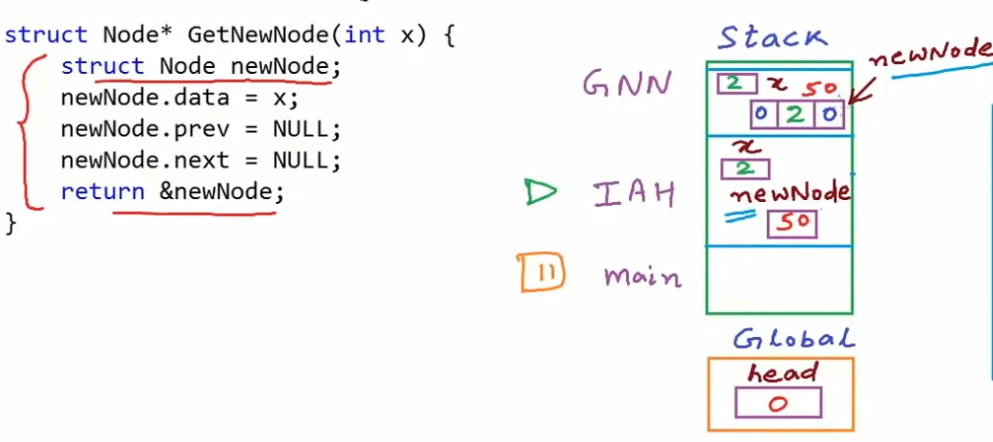

# Doubly Linked List

+ Reverse look-up
+ Extra memory for pointer to previous node

## Node structure
```c++
struct Node {
  int data;
  Node* next;
  Node* prev;
};
```
## Get a new node

In the implementation above, the stack frame of `GetNewNode()` will be reclaimed once the function finishes, so the memory of newNode that stay in stack section will be cleaned.

We can implementate this way:
```c++
Node* GetNewNode(int x) {
  Node* newNode = new Node;
  newNode->data = x;
  newNode->next = NULL;
  newNode->prev = NULL;
  return newNode;
}
```
## Insert at head
```c++
void insertHead(int n) {
  Node* temp = new Node;
  temp->data = n;
  temp->prev = NULL;
  temp->next = NULL;

  // if list is empty
  if (head == NULL) {
    head = temp;
    return;
  }

  temp->next = head;
  head->prev = temp;
  head = temp;
}
```
## Insert at tail
```c++
void insertTail(int n) {
  Node* new_node = new Node;
  new_node->data = n;
  new_node->next = NULL;
  new_node->prev = NULL;

  // if list is empty
  if (head == NULL) {
    head = new_node;
    return;
  }
  Node* temp = head;
  // traverse to the last node
  while (temp->next != NULL) {
    temp = temp->next;
  }
  temp->next = new_node;
  new_node->prev = temp;
}
```
## print
```c++
void print() {
  cout << "Forward: ";
  Node* temp = head;
  while (temp != NULL) {
    cout << temp->data << " ";
    temp = temp->next;
  }
  cout << endl;
}
```
## printReverse
```c++
void printReverse() {
  cout << "Reverse: ";
  // if empty, return
  if (head == NULL) {
    cout << endl;
    return;
  }
  Node* temp = head;
  // traverse to the last node
  while (temp->next != NULL) {
    temp = temp->next;
  }
  while (temp != NULL) {
    cout << temp->data << " ";
    temp = temp->prev;
  }
  cout << endl;
}
```